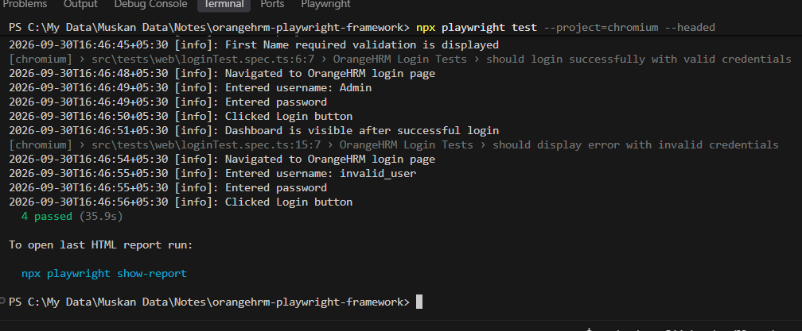
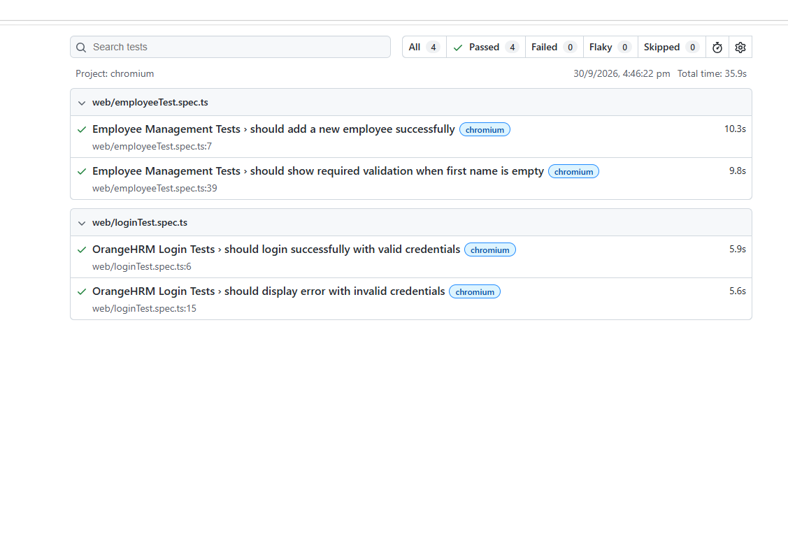
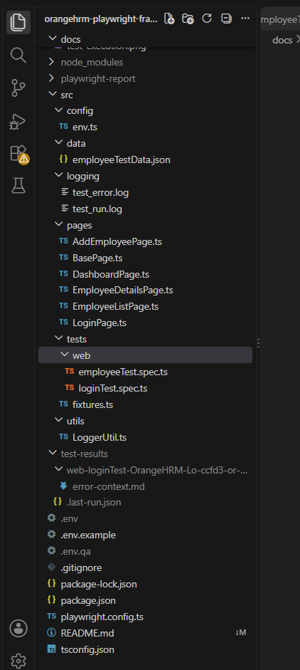

# 🚀 OrangeHRM - Playwright End-to-End Testing Framework

> A reusable end-to-end test automation framework built with **Playwright and TypeScript** for testing the OrangeHRM demo application.

---

## 📌 Project Overview

This project demonstrates the development of a reusable web test automation framework for the **OrangeHRM demo application**.

The framework is designed using the **Page Object Model (POM)** and reusable components to improve test maintainability, readability, and reusability.

The project focuses on automating important employee-management and authentication scenarios using Playwright.

### Automated Functional Areas

- 🔐 Login functionality
- ❌ Invalid login validation
- 👤 Employee creation
- ⚠️ Required-field validation
- 🧭 PIM / Employee Management navigation

---

## 🛠️ Tech Stack

| Technology | Purpose |
|------------|---------|
| 🎭 Playwright | End-to-End Test Automation |
| 📘 TypeScript | Programming Language |
| 🟢 Node.js | Runtime Environment |
| 📦 NPM | Package Management |
| 🧩 Page Object Model | Framework Design Pattern |
| 📝 JSON | Test Data Management |
| 📋 Winston | Logging |
| 📊 Playwright HTML Report | Test Reporting |
| 🔧 Git & GitHub | Version Control |

---

## ✨ Framework Features

- ✅ Page Object Model (POM)
- ✅ Reusable Base Page
- ✅ Reusable Playwright Fixtures
- ✅ Environment-based configuration
- ✅ External test data using JSON
- ✅ Positive and negative test scenarios
- ✅ Explicit synchronization and reusable waits
- ✅ Centralized logging
- ✅ Playwright HTML reporting
- ✅ Cross-browser test execution
- ✅ TypeScript-based automation
- ✅ Clean and maintainable project structure

---

## 📂 Project Structure

```text
orangehrm-playwright-framework/
│
├── docs/
│   ├── framework-structure.png
│   ├── html-report.png
│   └── test-execution.png
│
├── src/
│   │
│   ├── config/
│   │   └── env.ts
│   │
│   ├── data/
│   │   └── employeeTestData.json
│   │
│   ├── pages/
│   │   ├── AddEmployeePage.ts
│   │   ├── BasePage.ts
│   │   ├── DashboardPage.ts
│   │   ├── EmployeeDetailsPage.ts
│   │   ├── EmployeeListPage.ts
│   │   └── LoginPage.ts
│   │
│   ├── tests/
│   │   ├── fixtures.ts
│   │   └── web/
│   │       ├── employeeTest.spec.ts
│   │       └── loginTest.spec.ts
│   │
│   └── utils/
│       └── LoggerUtil.ts
│
├── .env.example
├── .gitignore
├── package.json
├── package-lock.json
├── playwright.config.ts
├── README.md
└── tsconfig.json
```

---

## 🧱 Framework Architecture

The framework follows a layered approach:

```text
Test Cases
    │
    ▼
Playwright Fixtures
    │
    ▼
Page Object Classes
    │
    ▼
Base Page
    │
    ▼
OrangeHRM Web Application
```

### Page Objects

Each major application page has a dedicated Page Object:

- `LoginPage` → Login functionality
- `DashboardPage` → Dashboard validation and PIM navigation
- `EmployeeListPage` → Employee list and employee actions
- `AddEmployeePage` → Employee creation and field validation
- `EmployeeDetailsPage` → Employee details validation
- `BasePage` → Common reusable actions and synchronization

---

## 🧪 Automated Test Scenarios

### 🔐 Login Tests

#### Positive Scenario

- Login with valid OrangeHRM credentials
- Verify Dashboard is displayed successfully

#### Negative Scenario

- Login with invalid username and password
- Verify that an error message is displayed

---

### 👤 Employee Management Tests

#### Positive Scenario

- Login successfully
- Open PIM module
- Open Employee List
- Navigate to Add Employee
- Enter employee details
- Save employee
- Verify Employee Personal Details page

#### Negative Scenario

- Login successfully
- Open PIM module
- Navigate to Add Employee
- Leave First Name empty
- Enter Last Name
- Click Save
- Verify required-field validation

---

## 📊 Test Execution

The framework contains **4 functional test cases** and executes them across:

- Chromium
- Firefox
- WebKit

### Final Test Result

```text
12 Tests Passed
12 Tests Executed
3 Browsers
0 Failures
```

The 4 test cases are executed against all 3 configured browsers.

---

## 🌐 Browser Support

The Playwright configuration supports:

```text
✓ Chromium
✓ Firefox
✓ WebKit
```

Run the complete cross-browser suite:

```bash
npx playwright test
```

Run tests only on Chromium:

```bash
npx playwright test --project=chromium
```

Run Chromium tests in headed mode:

```bash
npx playwright test --project=chromium --headed
```

---

## ⚙️ Setup Instructions

### Prerequisites

Make sure the following are installed:

- Node.js
- NPM
- Git
- VS Code (recommended)
- A supported web browser

### 1. Clone the Repository

```bash
git clone https://github.com/muskansharmaQAAutomation/orangehrm-playwright-framework.git
```

Navigate into the project:

```bash
cd orangehrm-playwright-framework
```

### 2. Install Dependencies

```bash
npm install
```

### 3. Configure Environment Variables

Create your environment configuration using the provided example:

```text
.env.example
```

Configure:

```env
WEB_URL=https://opensource-demo.orangehrmlive.com
USERNAME=your_username
PASSWORD=your_password
```

> Environment files containing credentials are excluded from Git using `.gitignore`.

### 4. Run Tests

Run the complete test suite:

```bash
npx playwright test
```

---

## 📋 Useful Playwright Commands

### Run all tests

```bash
npx playwright test
```

### Run Chromium tests

```bash
npx playwright test --project=chromium
```

### Run tests in headed mode

```bash
npx playwright test --headed
```

### Run a specific test file

```bash
npx playwright test src/tests/web/loginTest.spec.ts
```

### Open HTML Report

```bash
npx playwright show-report
```

---

## 📊 Test Reporting

Playwright's built-in HTML reporter is configured for the project.

After test execution, generate/view the report using:

```bash
npx playwright show-report
```

### Sample Execution



### HTML Report



---

## 🖼️ Framework Structure



---

## 🔐 Environment & Security

Sensitive environment files are intentionally excluded from version control.

The following files are ignored:

```text
.env
.env.*
```

A safe `.env.example` file is included so that another developer can understand the required configuration without exposing credentials.

---

## 🎯 Project Objectives

The main objectives of this project are:

- To develop a reusable end-to-end automation framework
- To apply the Page Object Model design pattern
- To reduce code duplication through reusable components
- To separate test data from test scripts
- To implement maintainable test automation using TypeScript
- To support cross-browser testing
- To generate structured automated test reports
- To demonstrate practical software testing and automation concepts

---

## 🚀 Future Enhancements

The framework can be extended in the future with:

- 🔄 CI/CD pipeline integration
- 📈 Advanced reporting
- 🧪 Additional OrangeHRM modules
- 🔍 More comprehensive test coverage
- 📸 Enhanced failure screenshots and traces
- ⚡ Parallel execution optimization

---

## 👩‍💻 Author

**Muskan Sharma**

QA & Test Automation | Playwright | TypeScript

---

## ⭐ Project

If you find this project useful, feel free to explore the repository and provide feedback.

**GitHub Repository:**

https://github.com/muskansharmaQAAutomation/orangehrm-playwright-framework


